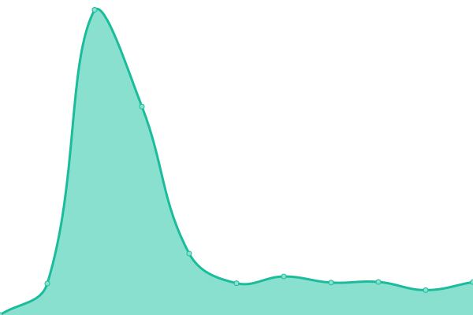
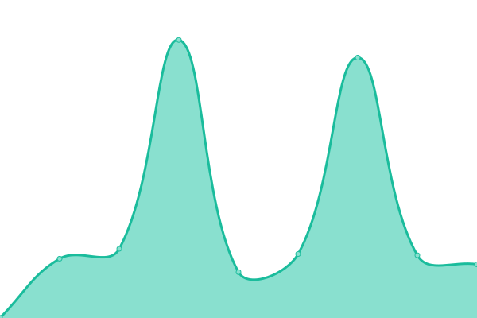
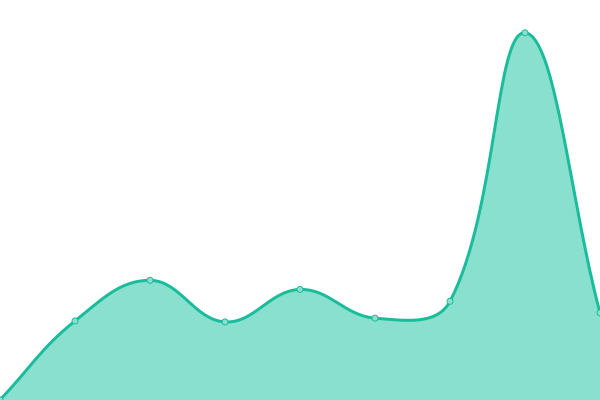
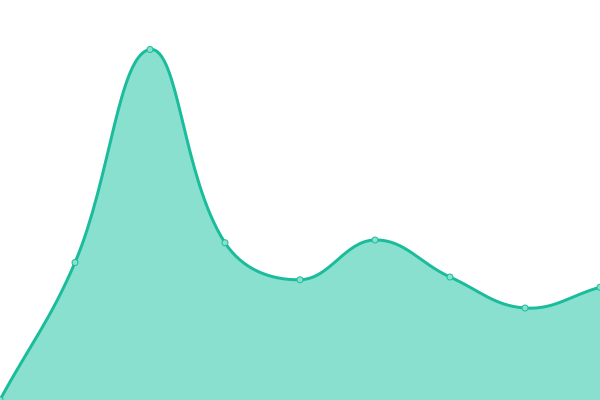
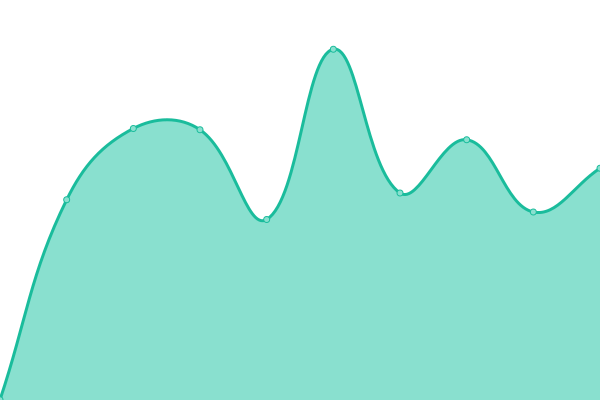

# [📈 Live Status](https://status.ttm.org): <!--live status--> **🟧 Partial outage**

This repository contains the open-source uptime monitor and status page for [tickets](https://ttm.org), powered by [Upptime](https://github.com/upptime/upptime).

With [Upptime](https://upptime.js.org), you can get your own unlimited and free uptime monitor and status page, powered entirely by a GitHub repository. We use [Issues](https://github.com/tickets/upptime/issues) as incident reports, [Actions](https://github.com/tickets/upptime/actions) as uptime monitors, and [Pages](https://status.ttm.org) for the status page.

<!--start: status pages-->
<!-- This summary is generated by Upptime (https://github.com/upptime/upptime) -->
<!-- Do not edit this manually, your changes will be overwritten -->
<!-- prettier-ignore -->
| URL | Status | History | Response Time | Uptime |
| --- | ------ | ------- | ------------- | ------ |
|  [TTM](https://ttm.org) | 🟩 Up | [ttm.yml](https://github.com/tickets/upptime/commits/HEAD/history/ttm.yml) | 

 530ms
     
 | 

<a href="https://status.ttm.org/history/ttm">96.22%</a>
    

|  [TICKETS.AF](https://tickets.af) | 🟩 Up | [tickets-af.yml](https://github.com/tickets/upptime/commits/HEAD/history/tickets-af.yml) | 

 2133ms
     
 | 

<a href="https://status.ttm.org/history/tickets-af">46.42%</a>
    

|  [TICKETS.AR](https://tickets.ar) | 🟩 Up | [tickets-ar.yml](https://github.com/tickets/upptime/commits/HEAD/history/tickets-ar.yml) | 

 777ms
     
 | 

<a href="https://status.ttm.org/history/tickets-ar">46.45%</a>
    

|  [TICKETS.AX](https://tickets.ax) | 🟩 Up | [tickets-ax.yml](https://github.com/tickets/upptime/commits/HEAD/history/tickets-ax.yml) | 

 751ms
     
 | 

<a href="https://status.ttm.org/history/tickets-ax">45.28%</a>
    

|  [TICKETS.DZ](https://tickets.dz) | 🟩 Up | [tickets-dz.yml](https://github.com/tickets/upptime/commits/HEAD/history/tickets-dz.yml) | 

 1004ms
     
 | 

<a href="https://status.ttm.org/history/tickets-dz">96.33%</a>
    

|  [TICKETS.ASIA](https://tickets.asia) | 🟩 Up | [tickets-asia.yml](https://github.com/tickets/upptime/commits/HEAD/history/tickets-asia.yml) | 

 896ms
     
 | 

<a href="https://status.ttm.org/history/tickets-asia">96.34%</a>
    

|  [TICKETS.BZ](https://tickets.bz) | 🟩 Up | [tickets-bz.yml](https://github.com/tickets/upptime/commits/HEAD/history/tickets-bz.yml) | 

 687ms
     
 | 

<a href="https://status.ttm.org/history/tickets-bz">96.36%</a>
    

|  [TICKETS.BJ](https://tickets.bj) | 🟩 Up | [tickets-bj.yml](https://github.com/tickets/upptime/commits/HEAD/history/tickets-bj.yml) | 

 888ms
     
 | 

<a href="https://status.ttm.org/history/tickets-bj">96.37%</a>
    

|  [TICKETS.BO](https://tickets.bo) | 🟩 Up | [tickets-bo.yml](https://github.com/tickets/upptime/commits/HEAD/history/tickets-bo.yml) | 

 825ms
     
 | 

<a href="https://status.ttm.org/history/tickets-bo">96.39%</a>
    

|  [TICKETS.BA](https://tickets.ba) | 🟩 Up | [tickets-ba.yml](https://github.com/tickets/upptime/commits/HEAD/history/tickets-ba.yml) | 

 828ms
     
 | 

<a href="https://status.ttm.org/history/tickets-ba">96.40%</a>
    

|  [TICKETS.TUR.BR](https://tickets.tur.br) | 🟩 Up | [tickets-tur-br.yml](https://github.com/tickets/upptime/commits/HEAD/history/tickets-tur-br.yml) | 

 828ms
     
 | 

<a href="https://status.ttm.org/history/tickets-tur-br">44.81%</a>
    

|  [TICKETS.COM.KH](https://tickets.com.kh) | 🟩 Up | [tickets-com-kh.yml](https://github.com/tickets/upptime/commits/HEAD/history/tickets-com-kh.yml) | 

 816ms
     
 | 

<a href="https://status.ttm.org/history/tickets-com-kh">96.42%</a>
    

|  [TICKETS.TD](https://tickets.td) | 🟩 Up | [tickets-td.yml](https://github.com/tickets/upptime/commits/HEAD/history/tickets-td.yml) | 

 859ms
     
 | 

<a href="https://status.ttm.org/history/tickets-td">96.44%</a>
    

|  [TICKETS.CL](https://tickets.cl) | 🟩 Up | [tickets-cl.yml](https://github.com/tickets/upptime/commits/HEAD/history/tickets-cl.yml) | 

 789ms
     
 | 

<a href="https://status.ttm.org/history/tickets-cl">96.45%</a>
    

|  [TICKETS.中国](https://tickets.中国) | 🟩 Up | [tickets.yml](https://github.com/tickets/upptime/commits/HEAD/history/tickets.yml) | 

 823ms
     
 | 

<a href="https://status.ttm.org/history/tickets">96.47%</a>
    

|  [TICKETS.COM.CO](https://tickets.com.co) | 🟩 Up | [tickets-com-co.yml](https://github.com/tickets/upptime/commits/HEAD/history/tickets-com-co.yml) | 

 731ms
     
 | 

<a href="https://status.ttm.org/history/tickets-com-co">96.48%</a>
    

|  [TICKETS.CR](https://tickets.cr) | 🟩 Up | [tickets-cr.yml](https://github.com/tickets/upptime/commits/HEAD/history/tickets-cr.yml) | 

 768ms
     
 | 

<a href="https://status.ttm.org/history/tickets-cr">96.50%</a>
    

|  [TICKETS.HR](https://tickets.hr) | 🟩 Up | [tickets-hr.yml](https://github.com/tickets/upptime/commits/HEAD/history/tickets-hr.yml) | 

 769ms
     
 | 

<a href="https://status.ttm.org/history/tickets-hr">45.58%</a>
    

|  [TICKETS.CY](https://tickets.cy) | 🟩 Up | [tickets-cy.yml](https://github.com/tickets/upptime/commits/HEAD/history/tickets-cy.yml) | 

 613ms
     
 | 

<a href="https://status.ttm.org/history/tickets-cy">96.53%</a>
    

|  [TICKETS.DO](https://tickets.do) | 🟩 Up | [tickets-do.yml](https://github.com/tickets/upptime/commits/HEAD/history/tickets-do.yml) | 

 814ms
     
 | 

<a href="https://status.ttm.org/history/tickets-do">96.54%</a>
    

|  [TICKETS.TL](https://tickets.tl) | 🟩 Up | [tickets-tl.yml](https://github.com/tickets/upptime/commits/HEAD/history/tickets-tl.yml) | 

 1286ms
     
 | 

<a href="https://status.ttm.org/history/tickets-tl">96.56%</a>
    

|  [TICKETS.EC](https://tickets.ec) | 🟩 Up | [tickets-ec.yml](https://github.com/tickets/upptime/commits/HEAD/history/tickets-ec.yml) | 

 1867ms
     
 | 

<a href="https://status.ttm.org/history/tickets-ec">88.11%</a>
    

|  [TICKETS.EG](https://tickets.eg) | 🟩 Up | [tickets-eg.yml](https://github.com/tickets/upptime/commits/HEAD/history/tickets-eg.yml) | 

 688ms
     
 | 

<a href="https://status.ttm.org/history/tickets-eg">96.59%</a>
    

|  [TICKETS.SV](https://tickets.sv) | 🟩 Up | [tickets-sv.yml](https://github.com/tickets/upptime/commits/HEAD/history/tickets-sv.yml) | 

 4618ms
     
 | 

<a href="https://status.ttm.org/history/tickets-sv">89.74%</a>
    

|  [TICKETS.ET](https://tickets.et) | 🟩 Up | [tickets-et.yml](https://github.com/tickets/upptime/commits/HEAD/history/tickets-et.yml) | 

 1084ms
     
 | 

<a href="https://status.ttm.org/history/tickets-et">49.20%</a>
    

|  [TICKETS.GA](https://tickets.ga) | 🟩 Up | [tickets-ga.yml](https://github.com/tickets/upptime/commits/HEAD/history/tickets-ga.yml) | 

 791ms
     
 | 

<a href="https://status.ttm.org/history/tickets-ga">49.21%</a>
    

|  [TICKETS.GF](https://tickets.gf) | 🟩 Up | [tickets-gf.yml](https://github.com/tickets/upptime/commits/HEAD/history/tickets-gf.yml) | 

 681ms
     
 | 

<a href="https://status.ttm.org/history/tickets-gf">96.64%</a>
    

|  [TICKETS.COM.GE](https://tickets.com.ge) | 🟩 Up | [tickets-com-ge.yml](https://github.com/tickets/upptime/commits/HEAD/history/tickets-com-ge.yml) | 

 808ms
     
 | 

<a href="https://status.ttm.org/history/tickets-com-ge">96.65%</a>
    

|  [TICKETS.CO.DE](https://tickets.co.de) | 🟩 Up | [tickets-co-de.yml](https://github.com/tickets/upptime/commits/HEAD/history/tickets-co-de.yml) | 

 2095ms
     
 | 

<a href="https://status.ttm.org/history/tickets-co-de">96.23%</a>
    

|  [TICKETS.COM.GR](https://tickets.com.gr) | 🟩 Up | [tickets-com-gr.yml](https://github.com/tickets/upptime/commits/HEAD/history/tickets-com-gr.yml) | 

 683ms
     
 | 

<a href="https://status.ttm.org/history/tickets-com-gr">96.68%</a>
    

|  [TICKETS.GL](https://tickets.gl) | 🟩 Up | [tickets-gl.yml](https://github.com/tickets/upptime/commits/HEAD/history/tickets-gl.yml) | 

 717ms
     
 | 

<a href="https://status.ttm.org/history/tickets-gl">96.70%</a>
    

|  [TICKETS.GT](https://tickets.gt) | 🟩 Up | [tickets-gt.yml](https://github.com/tickets/upptime/commits/HEAD/history/tickets-gt.yml) | 

 4119ms
     
 | 

<a href="https://status.ttm.org/history/tickets-gt">91.97%</a>
    

|  [TICKETS.GY](https://tickets.gy) | 🟩 Up | [tickets-gy.yml](https://github.com/tickets/upptime/commits/HEAD/history/tickets-gy.yml) | 

 794ms
     
 | 

<a href="https://status.ttm.org/history/tickets-gy">46.16%</a>
    

|  [TICKETS.HT](https://tickets.ht) | 🟩 Up | [tickets-ht.yml](https://github.com/tickets/upptime/commits/HEAD/history/tickets-ht.yml) | 

 686ms
     
 | 

<a href="https://status.ttm.org/history/tickets-ht">46.17%</a>
    

|  [TICKETS.HN](https://tickets.hn) | 🟩 Up | [tickets-hn.yml](https://github.com/tickets/upptime/commits/HEAD/history/tickets-hn.yml) | 

 767ms
     
 | 

<a href="https://status.ttm.org/history/tickets-hn">46.19%</a>
    

|  [TICKETS.ORG.IN](https://tickets.org.in) | 🟩 Up | [tickets-org-in.yml](https://github.com/tickets/upptime/commits/HEAD/history/tickets-org-in.yml) | 

 715ms
     
 | 

<a href="https://status.ttm.org/history/tickets-org-in">96.77%</a>
    

|  [TICKETS.CO.ID](https://tickets.co.id) | 🟩 Up | [tickets-co-id.yml](https://github.com/tickets/upptime/commits/HEAD/history/tickets-co-id.yml) | 

 829ms
     
 | 

<a href="https://status.ttm.org/history/tickets-co-id">96.79%</a>
    

|  [TICKETS.CI](https://tickets.ci) | 🟩 Up | [tickets-ci.yml](https://github.com/tickets/upptime/commits/HEAD/history/tickets-ci.yml) | 

 667ms
     
 | 

<a href="https://status.ttm.org/history/tickets-ci">96.80%</a>
    

|  [TICKETS.CO.JP](http://tickets.co.jp) | 🟩 Up | [tickets-co-jp.yml](https://github.com/tickets/upptime/commits/HEAD/history/tickets-co-jp.yml) | 

 1915ms
     
 | 

<a href="https://status.ttm.org/history/tickets-co-jp">96.82%</a>
    

|  [TICKETS.KE](https://tickets.ke) | 🟩 Up | [tickets-ke.yml](https://github.com/tickets/upptime/commits/HEAD/history/tickets-ke.yml) | 

 883ms
     
 | 

<a href="https://status.ttm.org/history/tickets-ke">96.84%</a>
    

|  [TICKETS.LA](https://tickets.la) | 🟩 Up | [tickets-la.yml](https://github.com/tickets/upptime/commits/HEAD/history/tickets-la.yml) | 

 3189ms
     
 | 

<a href="https://status.ttm.org/history/tickets-la">55.12%</a>
    

|  [TICKETS.LY](https://tickets.ly) | 🟩 Up | [tickets-ly.yml](https://github.com/tickets/upptime/commits/HEAD/history/tickets-ly.yml) | 

 701ms
     
 | 

<a href="https://status.ttm.org/history/tickets-ly">96.87%</a>
    

|  [TICKETS.MG](https://tickets.mg) | 🟩 Up | [tickets-mg.yml](https://github.com/tickets/upptime/commits/HEAD/history/tickets-mg.yml) | 

 947ms
     
 | 

<a href="https://status.ttm.org/history/tickets-mg">96.88%</a>
    

|  [TICKETS.ML](https://tickets.ml) | 🟩 Up | [tickets-ml.yml](https://github.com/tickets/upptime/commits/HEAD/history/tickets-ml.yml) | 

 736ms
     
 | 

<a href="https://status.ttm.org/history/tickets-ml">96.90%</a>
    

|  [TICKETS.MR](https://tickets.mr) | 🟩 Up | [tickets-mr.yml](https://github.com/tickets/upptime/commits/HEAD/history/tickets-mr.yml) | 

 885ms
     
 | 

<a href="https://status.ttm.org/history/tickets-mr">96.91%</a>
    

|  [TICKETS.CO.MA](https://tickets.co.ma) | 🟩 Up | [tickets-co-ma.yml](https://github.com/tickets/upptime/commits/HEAD/history/tickets-co-ma.yml) | 

 687ms
     
 | 

<a href="https://status.ttm.org/history/tickets-co-ma">96.93%</a>
    

|  [TICKETS.CO.MZ](https://tickets.co.mz) | 🟩 Up | [tickets-co-mz.yml](https://github.com/tickets/upptime/commits/HEAD/history/tickets-co-mz.yml) | 

 785ms
     
 | 

<a href="https://status.ttm.org/history/tickets-co-mz">96.94%</a>
    

|  [TICKETS.NU](https://tickets.nu) | 🟩 Up | [tickets-nu.yml](https://github.com/tickets/upptime/commits/HEAD/history/tickets-nu.yml) | 

 685ms
     
 | 

<a href="https://status.ttm.org/history/tickets-nu">96.96%</a>
    

|  [TICKETS.COM.NI](https://tickets.com.ni) | 🟩 Up | [tickets-com-ni.yml](https://github.com/tickets/upptime/commits/HEAD/history/tickets-com-ni.yml) | 

 1495ms
     
 | 

<a href="https://status.ttm.org/history/tickets-com-ni">96.79%</a>
    

|  [TICKETS.NG](https://tickets.ng) | 🟩 Up | [tickets-ng.yml](https://github.com/tickets/upptime/commits/HEAD/history/tickets-ng.yml) | 

 925ms
     
 | 

<a href="https://status.ttm.org/history/tickets-ng">47.15%</a>
    

|  [TICKETS.COM.PK](https://tickets.com.pk) | 🟩 Up | [tickets-com-pk.yml](https://github.com/tickets/upptime/commits/HEAD/history/tickets-com-pk.yml) | 

 1304ms
     
 | 

<a href="https://status.ttm.org/history/tickets-com-pk">96.83%</a>
    

|  [TICKETS.PA](https://tickets.pa) | 🟩 Up | [tickets-pa.yml](https://github.com/tickets/upptime/commits/HEAD/history/tickets-pa.yml) | 

 3814ms
     
 | 

<a href="https://status.ttm.org/history/tickets-pa">89.94%</a>
    

|  [TICKETS.COM.PY](https://tickets.com.py) | 🟩 Up | [tickets-com-py.yml](https://github.com/tickets/upptime/commits/HEAD/history/tickets-com-py.yml) | 

 776ms
     
 | 

<a href="https://status.ttm.org/history/tickets-com-py">47.18%</a>
    

|  [TICKETS.PE](https://tickets.pe) | 🟩 Up | [tickets-pe.yml](https://github.com/tickets/upptime/commits/HEAD/history/tickets-pe.yml) | 

 1712ms
     
 | 

<a href="https://status.ttm.org/history/tickets-pe">46.86%</a>
    

|  [TICKETS.PH](https://tickets.ph) | 🟩 Up | [tickets-ph.yml](https://github.com/tickets/upptime/commits/HEAD/history/tickets-ph.yml) | 

 2212ms
     
 | 

<a href="https://status.ttm.org/history/tickets-ph">78.39%</a>
    

|  [TICKETS.PT](https://tickets.pt) | 🟩 Up | [tickets-pt.yml](https://github.com/tickets/upptime/commits/HEAD/history/tickets-pt.yml) | 

 742ms
     
 | 

<a href="https://status.ttm.org/history/tickets-pt">47.41%</a>
    

|  [TICKETS.COM.PR](https://tickets.com.pr) | 🟩 Up | [tickets-com-pr.yml](https://github.com/tickets/upptime/commits/HEAD/history/tickets-com-pr.yml) | 

 775ms
     
 | 

<a href="https://status.ttm.org/history/tickets-com-pr">97.09%</a>
    

|  [TICKETS.LC](https://tickets.lc) | 🟩 Up | [tickets-lc.yml](https://github.com/tickets/upptime/commits/HEAD/history/tickets-lc.yml) | 

 811ms
     
 | 

<a href="https://status.ttm.org/history/tickets-lc">97.11%</a>
    

|  [TICKETS.SN](https://tickets.sn) | 🟩 Up | [tickets-sn.yml](https://github.com/tickets/upptime/commits/HEAD/history/tickets-sn.yml) | 

 739ms
     
 | 

<a href="https://status.ttm.org/history/tickets-sn">97.13%</a>
    

|  [TICKETS.COM.SG](https://tickets.com.sg) | 🟩 Up | [tickets-com-sg.yml](https://github.com/tickets/upptime/commits/HEAD/history/tickets-com-sg.yml) | 

 4829ms
     
 | 

<a href="https://status.ttm.org/history/tickets-com-sg">90.54%</a>
    

|  [TICKETS.SO](https://tickets.so) | 🟩 Up | [tickets-so.yml](https://github.com/tickets/upptime/commits/HEAD/history/tickets-so.yml) | 

 884ms
     
 | 

<a href="https://status.ttm.org/history/tickets-so">97.16%</a>
    

|  [TICKETS.SD](https://tickets.sd) | 🟩 Up | [tickets-sd.yml](https://github.com/tickets/upptime/commits/HEAD/history/tickets-sd.yml) | 

 1558ms
     
 | 

<a href="https://status.ttm.org/history/tickets-sd">46.59%</a>
    

|  [TICKETS.SR](https://tickets.sr) | 🟩 Up | [tickets-sr.yml](https://github.com/tickets/upptime/commits/HEAD/history/tickets-sr.yml) | 

 1583ms
     
 | 

<a href="https://status.ttm.org/history/tickets-sr">46.61%</a>
    

|  [TICKETS.SE](https://tickets.se) | 🟩 Up | [tickets-se.yml](https://github.com/tickets/upptime/commits/HEAD/history/tickets-se.yml) | 

 667ms
     
 | 

<a href="https://status.ttm.org/history/tickets-se">46.62%</a>
    

|  [TICKETS.TJ](https://tickets.tj) | 🟩 Up | [tickets-tj.yml](https://github.com/tickets/upptime/commits/HEAD/history/tickets-tj.yml) | 

 786ms
     
 | 

<a href="https://status.ttm.org/history/tickets-tj">97.22%</a>
    

|  [TICKETS.TZ](https://tickets.tz) | 🟩 Up | [tickets-tz.yml](https://github.com/tickets/upptime/commits/HEAD/history/tickets-tz.yml) | 

 804ms
     
 | 

<a href="https://status.ttm.org/history/tickets-tz">97.23%</a>
    

|  [TICKETS.IN.TH](https://tickets.in.th) | 🟩 Up | [tickets-in-th.yml](https://github.com/tickets/upptime/commits/HEAD/history/tickets-in-th.yml) | 

 875ms
     
 | 

<a href="https://status.ttm.org/history/tickets-in-th">97.24%</a>
    

|  [TICKETS.TG](https://tickets.tg) | 🟥 Down | [tickets-tg.yml](https://github.com/tickets/upptime/commits/HEAD/history/tickets-tg.yml) | 

 3006ms
     
 | 

<a href="https://status.ttm.org/history/tickets-tg">97.24%</a>
    

|  [TICKETS.CO.TT](https://tickets.co.tt) | 🟥 Down | [tickets-co-tt.yml](https://github.com/tickets/upptime/commits/HEAD/history/tickets-co-tt.yml) | 

 1166ms
     
 | 

<a href="https://status.ttm.org/history/tickets-co-tt">97.25%</a>
    

|  [TICKETS.TN](https://tickets.tn) | 🟩 Up | [tickets-tn.yml](https://github.com/tickets/upptime/commits/HEAD/history/tickets-tn.yml) | 

 693ms
     
 | 

<a href="https://status.ttm.org/history/tickets-tn">97.03%</a>
    

|  [TICKETS.WEB.TR](https://tickets.web.tr) | 🟩 Up | [tickets-web-tr.yml](https://github.com/tickets/upptime/commits/HEAD/history/tickets-web-tr.yml) | 

 685ms
     
 | 

<a href="https://status.ttm.org/history/tickets-web-tr">97.05%</a>
    

|  [TICKETS.IN.UA](https://tickets.in.ua) | 🟩 Up | [tickets-in-ua.yml](https://github.com/tickets/upptime/commits/HEAD/history/tickets-in-ua.yml) | 

 939ms
     
 | 

<a href="https://status.ttm.org/history/tickets-in-ua">97.32%</a>
    

|  [TICKETS.ME.UK](https://tickets.me.uk) | 🟩 Up | [tickets-me-uk.yml](https://github.com/tickets/upptime/commits/HEAD/history/tickets-me-uk.yml) | 

 760ms
     
 | 

<a href="https://status.ttm.org/history/tickets-me-uk">97.34%</a>
    

|  [TICKETS.US](https://tickets.us) | 🟩 Up | [tickets-us.yml](https://github.com/tickets/upptime/commits/HEAD/history/tickets-us.yml) | 

 798ms
     
 | 

<a href="https://status.ttm.org/history/tickets-us">46.01%</a>
    

|  [TICKETS.COM.VE](https://tickets.com.ve) | 🟩 Up | [tickets-com-ve.yml](https://github.com/tickets/upptime/commits/HEAD/history/tickets-com-ve.yml) | 

 2598ms
     
 | 

<a href="https://status.ttm.org/history/tickets-com-ve">87.75%</a>
    

|  [TICKETS.VN](https://tickets.vn) | 🟩 Up | [tickets-vn.yml](https://github.com/tickets/upptime/commits/HEAD/history/tickets-vn.yml) | 

 805ms
     
 | 

<a href="https://status.ttm.org/history/tickets-vn">94.94%</a>
    

<!--end: status pages-->

[**Visit our status website →**](https://status.ttm.org)

## 📄 License

- Powered by: [Upptime](https://github.com/upptime/upptime)
- Code: [MIT](./LICENSE) © [tickets](https://ttm.org)
- Data in the `./history` directory: [Open Database License](https://opendatacommons.org/licenses/odbl/1-0/)
