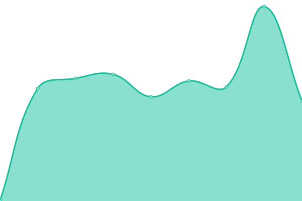
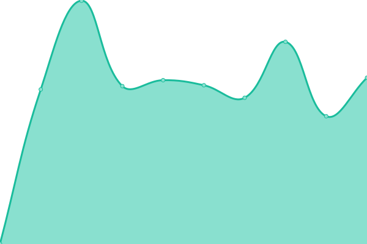

# [📈 Live Status](https://status.ttm.org): <!--live status--> **🟥 Complete outage**

This repository contains the open-source uptime monitor and status page for [tickets](https://ttm.org), powered by [Upptime](https://github.com/upptime/upptime).

With [Upptime](https://upptime.js.org), you can get your own unlimited and free uptime monitor and status page, powered entirely by a GitHub repository. We use [Issues](https://github.com/tickets/upptime/issues) as incident reports, [Actions](https://github.com/tickets/upptime/actions) as uptime monitors, and [Pages](https://status.ttm.org) for the status page.

<!--start: status pages-->
<!-- This summary is generated by Upptime (https://github.com/upptime/upptime) -->
<!-- Do not edit this manually, your changes will be overwritten -->
<!-- prettier-ignore -->
| URL | Status | History | Response Time | Uptime |
| --- | ------ | ------- | ------------- | ------ |
|  [TTM](https://ttm.org) | 🟥 Down | [ttm.yml](https://github.com/tickets/upptime/commits/HEAD/history/ttm.yml) | 

 562ms
     
 | 

<a href="https://status.ttm.org/history/ttm">97.60%</a>
    

|  [TICKETS.AF](https://tickets.af) | 🟥 Down | [tickets-af.yml](https://github.com/tickets/upptime/commits/HEAD/history/tickets-af.yml) | 

 960ms
     
 | 

<a href="https://status.ttm.org/history/tickets-af">96.60%</a>
    

|  [TICKETS.AR](https://tickets.ar) | 🟥 Down | [tickets-ar.yml](https://github.com/tickets/upptime/commits/HEAD/history/tickets-ar.yml) | 

 777ms
     
 | 

<a href="https://status.ttm.org/history/tickets-ar">97.63%</a>
    

|  [TICKETS.AX](https://tickets.ax) | 🟥 Down | [tickets-ax.yml](https://github.com/tickets/upptime/commits/HEAD/history/tickets-ax.yml) | 

 717ms
     
 | 

<a href="https://status.ttm.org/history/tickets-ax">97.65%</a>
    

|  [TICKETS.DZ](https://tickets.dz) | 🟥 Down | [tickets-dz.yml](https://github.com/tickets/upptime/commits/HEAD/history/tickets-dz.yml) | 

 998ms
     
 | 

<a href="https://status.ttm.org/history/tickets-dz">97.65%</a>
    

|  [TICKETS.ASIA](https://tickets.asia) | 🟥 Down | [tickets-asia.yml](https://github.com/tickets/upptime/commits/HEAD/history/tickets-asia.yml) | 

 857ms
     
 | 

<a href="https://status.ttm.org/history/tickets-asia">97.67%</a>
    

|  [TICKETS.BZ](https://tickets.bz) | 🟥 Down | [tickets-bz.yml](https://github.com/tickets/upptime/commits/HEAD/history/tickets-bz.yml) | 

 667ms
     
 | 

<a href="https://status.ttm.org/history/tickets-bz">97.68%</a>
    

|  [TICKETS.BJ](https://tickets.bj) | 🟥 Down | [tickets-bj.yml](https://github.com/tickets/upptime/commits/HEAD/history/tickets-bj.yml) | 

 867ms
     
 | 

<a href="https://status.ttm.org/history/tickets-bj">97.70%</a>
    

|  [TICKETS.BO](https://tickets.bo) | 🟥 Down | [tickets-bo.yml](https://github.com/tickets/upptime/commits/HEAD/history/tickets-bo.yml) | 

 815ms
     
 | 

<a href="https://status.ttm.org/history/tickets-bo">97.71%</a>
    

|  [TICKETS.BA](https://tickets.ba) | 🟥 Down | [tickets-ba.yml](https://github.com/tickets/upptime/commits/HEAD/history/tickets-ba.yml) | 

 778ms
     
 | 

<a href="https://status.ttm.org/history/tickets-ba">97.73%</a>
    

|  [TICKETS.TUR.BR](https://tickets.tur.br) | 🟥 Down | [tickets-tur-br.yml](https://github.com/tickets/upptime/commits/HEAD/history/tickets-tur-br.yml) | 

 825ms
     
 | 

<a href="https://status.ttm.org/history/tickets-tur-br">97.74%</a>
    

|  [TICKETS.COM.KH](https://tickets.com.kh) | 🟥 Down | [tickets-com-kh.yml](https://github.com/tickets/upptime/commits/HEAD/history/tickets-com-kh.yml) | 

 869ms
     
 | 

<a href="https://status.ttm.org/history/tickets-com-kh">97.75%</a>
    

|  [TICKETS.TD](https://tickets.td) | 🟥 Down | [tickets-td.yml](https://github.com/tickets/upptime/commits/HEAD/history/tickets-td.yml) | 

 855ms
     
 | 

<a href="https://status.ttm.org/history/tickets-td">97.76%</a>
    

|  [TICKETS.CL](https://tickets.cl) | 🟥 Down | [tickets-cl.yml](https://github.com/tickets/upptime/commits/HEAD/history/tickets-cl.yml) | 

 789ms
     
 | 

<a href="https://status.ttm.org/history/tickets-cl">97.78%</a>
    

|  [TICKETS.中国](https://tickets.中国) | 🟥 Down | [tickets.yml](https://github.com/tickets/upptime/commits/HEAD/history/tickets.yml) | 

 721ms
     
 | 

<a href="https://status.ttm.org/history/tickets">97.79%</a>
    

|  [TICKETS.COM.CO](https://tickets.com.co) | 🟥 Down | [tickets-com-co.yml](https://github.com/tickets/upptime/commits/HEAD/history/tickets-com-co.yml) | 

 723ms
     
 | 

<a href="https://status.ttm.org/history/tickets-com-co">97.81%</a>
    

|  [TICKETS.CR](https://tickets.cr) | 🟥 Down | [tickets-cr.yml](https://github.com/tickets/upptime/commits/HEAD/history/tickets-cr.yml) | 

 762ms
     
 | 

<a href="https://status.ttm.org/history/tickets-cr">97.82%</a>
    

|  [TICKETS.HR](https://tickets.hr) | 🟥 Down | [tickets-hr.yml](https://github.com/tickets/upptime/commits/HEAD/history/tickets-hr.yml) | 

 779ms
     
 | 

<a href="https://status.ttm.org/history/tickets-hr">97.84%</a>
    

|  [TICKETS.CY](https://tickets.cy) | 🟥 Down | [tickets-cy.yml](https://github.com/tickets/upptime/commits/HEAD/history/tickets-cy.yml) | 

 599ms
     
 | 

<a href="https://status.ttm.org/history/tickets-cy">97.85%</a>
    

|  [TICKETS.DO](https://tickets.do) | 🟥 Down | [tickets-do.yml](https://github.com/tickets/upptime/commits/HEAD/history/tickets-do.yml) | 

 795ms
     
 | 

<a href="https://status.ttm.org/history/tickets-do">97.87%</a>
    

|  [TICKETS.TL](https://tickets.tl) | 🟥 Down | [tickets-tl.yml](https://github.com/tickets/upptime/commits/HEAD/history/tickets-tl.yml) | 

 841ms
     
 | 

<a href="https://status.ttm.org/history/tickets-tl">97.88%</a>
    

|  [TICKETS.EC](https://tickets.ec) | 🟥 Down | [tickets-ec.yml](https://github.com/tickets/upptime/commits/HEAD/history/tickets-ec.yml) | 

 2945ms
     
 | 

<a href="https://status.ttm.org/history/tickets-ec">97.90%</a>
    

|  [TICKETS.EG](https://tickets.eg) | 🟥 Down | [tickets-eg.yml](https://github.com/tickets/upptime/commits/HEAD/history/tickets-eg.yml) | 

 746ms
     
 | 

<a href="https://status.ttm.org/history/tickets-eg">97.91%</a>
    

|  [TICKETS.SV](https://tickets.sv) | 🟥 Down | [tickets-sv.yml](https://github.com/tickets/upptime/commits/HEAD/history/tickets-sv.yml) | 

 754ms
     
 | 

<a href="https://status.ttm.org/history/tickets-sv">97.93%</a>
    

|  [TICKETS.ET](https://tickets.et) | 🟥 Down | [tickets-et.yml](https://github.com/tickets/upptime/commits/HEAD/history/tickets-et.yml) | 

 1114ms
     
 | 

<a href="https://status.ttm.org/history/tickets-et">97.93%</a>
    

|  [TICKETS.GA](https://tickets.ga) | 🟥 Down | [tickets-ga.yml](https://github.com/tickets/upptime/commits/HEAD/history/tickets-ga.yml) | 

 755ms
     
 | 

<a href="https://status.ttm.org/history/tickets-ga">97.95%</a>
    

|  [TICKETS.GF](https://tickets.gf) | 🟥 Down | [tickets-gf.yml](https://github.com/tickets/upptime/commits/HEAD/history/tickets-gf.yml) | 

 691ms
     
 | 

<a href="https://status.ttm.org/history/tickets-gf">97.96%</a>
    

|  [TICKETS.COM.GE](https://tickets.com.ge) | 🟥 Down | [tickets-com-ge.yml](https://github.com/tickets/upptime/commits/HEAD/history/tickets-com-ge.yml) | 

 827ms
     
 | 

<a href="https://status.ttm.org/history/tickets-com-ge">97.98%</a>
    

|  [TICKETS.CO.DE](https://tickets.co.de) | 🟥 Down | [tickets-co-de.yml](https://github.com/tickets/upptime/commits/HEAD/history/tickets-co-de.yml) | 

 1693ms
     
 | 

<a href="https://status.ttm.org/history/tickets-co-de">96.54%</a>
    

|  [TICKETS.COM.GR](https://tickets.com.gr) | 🟥 Down | [tickets-com-gr.yml](https://github.com/tickets/upptime/commits/HEAD/history/tickets-com-gr.yml) | 

 680ms
     
 | 

<a href="https://status.ttm.org/history/tickets-com-gr">98.01%</a>
    

|  [TICKETS.GL](https://tickets.gl) | 🟥 Down | [tickets-gl.yml](https://github.com/tickets/upptime/commits/HEAD/history/tickets-gl.yml) | 

 721ms
     
 | 

<a href="https://status.ttm.org/history/tickets-gl">98.02%</a>
    

|  [TICKETS.GT](https://tickets.gt) | 🟥 Down | [tickets-gt.yml](https://github.com/tickets/upptime/commits/HEAD/history/tickets-gt.yml) | 

 791ms
     
 | 

<a href="https://status.ttm.org/history/tickets-gt">98.04%</a>
    

|  [TICKETS.GY](https://tickets.gy) | 🟥 Down | [tickets-gy.yml](https://github.com/tickets/upptime/commits/HEAD/history/tickets-gy.yml) | 

 803ms
     
 | 

<a href="https://status.ttm.org/history/tickets-gy">98.05%</a>
    

|  [TICKETS.HT](https://tickets.ht) | 🟥 Down | [tickets-ht.yml](https://github.com/tickets/upptime/commits/HEAD/history/tickets-ht.yml) | 

 666ms
     
 | 

<a href="https://status.ttm.org/history/tickets-ht">98.07%</a>
    

|  [TICKETS.HN](https://tickets.hn) | 🟥 Down | [tickets-hn.yml](https://github.com/tickets/upptime/commits/HEAD/history/tickets-hn.yml) | 

 789ms
     
 | 

<a href="https://status.ttm.org/history/tickets-hn">98.08%</a>
    

|  [TICKETS.ORG.IN](https://tickets.org.in) | 🟥 Down | [tickets-org-in.yml](https://github.com/tickets/upptime/commits/HEAD/history/tickets-org-in.yml) | 

 719ms
     
 | 

<a href="https://status.ttm.org/history/tickets-org-in">98.10%</a>
    

|  [TICKETS.CO.ID](https://tickets.co.id) | 🟥 Down | [tickets-co-id.yml](https://github.com/tickets/upptime/commits/HEAD/history/tickets-co-id.yml) | 

 882ms
     
 | 

<a href="https://status.ttm.org/history/tickets-co-id">97.79%</a>
    

|  [TICKETS.CI](https://tickets.ci) | 🟥 Down | [tickets-ci.yml](https://github.com/tickets/upptime/commits/HEAD/history/tickets-ci.yml) | 

 739ms
     
 | 

<a href="https://status.ttm.org/history/tickets-ci">98.13%</a>
    

|  [TICKETS.CO.JP](http://tickets.co.jp) | 🟥 Down | [tickets-co-jp.yml](https://github.com/tickets/upptime/commits/HEAD/history/tickets-co-jp.yml) | 

 1953ms
     
 | 

<a href="https://status.ttm.org/history/tickets-co-jp">98.14%</a>
    

|  [TICKETS.KE](https://tickets.ke) | 🟥 Down | [tickets-ke.yml](https://github.com/tickets/upptime/commits/HEAD/history/tickets-ke.yml) | 

 967ms
     
 | 

<a href="https://status.ttm.org/history/tickets-ke">98.16%</a>
    

|  [TICKETS.LA](https://tickets.la) | 🟥 Down | [tickets-la.yml](https://github.com/tickets/upptime/commits/HEAD/history/tickets-la.yml) | 

 730ms
     
 | 

<a href="https://status.ttm.org/history/tickets-la">98.17%</a>
    

|  [TICKETS.LY](https://tickets.ly) | 🟥 Down | [tickets-ly.yml](https://github.com/tickets/upptime/commits/HEAD/history/tickets-ly.yml) | 

 661ms
     
 | 

<a href="https://status.ttm.org/history/tickets-ly">98.19%</a>
    

|  [TICKETS.MG](https://tickets.mg) | 🟥 Down | [tickets-mg.yml](https://github.com/tickets/upptime/commits/HEAD/history/tickets-mg.yml) | 

 801ms
     
 | 

<a href="https://status.ttm.org/history/tickets-mg">98.20%</a>
    

|  [TICKETS.ML](https://tickets.ml) | 🟥 Down | [tickets-ml.yml](https://github.com/tickets/upptime/commits/HEAD/history/tickets-ml.yml) | 

 797ms
     
 | 

<a href="https://status.ttm.org/history/tickets-ml">98.22%</a>
    

|  [TICKETS.MR](https://tickets.mr) | 🟥 Down | [tickets-mr.yml](https://github.com/tickets/upptime/commits/HEAD/history/tickets-mr.yml) | 

 913ms
     
 | 

<a href="https://status.ttm.org/history/tickets-mr">98.23%</a>
    

|  [TICKETS.CO.MA](https://tickets.co.ma) | 🟥 Down | [tickets-co-ma.yml](https://github.com/tickets/upptime/commits/HEAD/history/tickets-co-ma.yml) | 

 808ms
     
 | 

<a href="https://status.ttm.org/history/tickets-co-ma">98.25%</a>
    

|  [TICKETS.CO.MZ](https://tickets.co.mz) | 🟥 Down | [tickets-co-mz.yml](https://github.com/tickets/upptime/commits/HEAD/history/tickets-co-mz.yml) | 

 809ms
     
 | 

<a href="https://status.ttm.org/history/tickets-co-mz">98.26%</a>
    

|  [TICKETS.NU](https://tickets.nu) | 🟥 Down | [tickets-nu.yml](https://github.com/tickets/upptime/commits/HEAD/history/tickets-nu.yml) | 

 714ms
     
 | 

<a href="https://status.ttm.org/history/tickets-nu">98.28%</a>
    

|  [TICKETS.COM.NI](https://tickets.com.ni) | 🟥 Down | [tickets-com-ni.yml](https://github.com/tickets/upptime/commits/HEAD/history/tickets-com-ni.yml) | 

 1999ms
     
 | 

<a href="https://status.ttm.org/history/tickets-com-ni">98.29%</a>
    

|  [TICKETS.NG](https://tickets.ng) | 🟥 Down | [tickets-ng.yml](https://github.com/tickets/upptime/commits/HEAD/history/tickets-ng.yml) | 

 892ms
     
 | 

<a href="https://status.ttm.org/history/tickets-ng">98.00%</a>
    

|  [TICKETS.COM.PK](https://tickets.com.pk) | 🟥 Down | [tickets-com-pk.yml](https://github.com/tickets/upptime/commits/HEAD/history/tickets-com-pk.yml) | 

 748ms
     
 | 

<a href="https://status.ttm.org/history/tickets-com-pk">98.32%</a>
    

|  [TICKETS.PA](https://tickets.pa) | 🟥 Down | [tickets-pa.yml](https://github.com/tickets/upptime/commits/HEAD/history/tickets-pa.yml) | 

 816ms
     
 | 

<a href="https://status.ttm.org/history/tickets-pa">98.34%</a>
    

|  [TICKETS.COM.PY](https://tickets.com.py) | 🟥 Down | [tickets-com-py.yml](https://github.com/tickets/upptime/commits/HEAD/history/tickets-com-py.yml) | 

 784ms
     
 | 

<a href="https://status.ttm.org/history/tickets-com-py">98.35%</a>
    

|  [TICKETS.PE](https://tickets.pe) | 🟥 Down | [tickets-pe.yml](https://github.com/tickets/upptime/commits/HEAD/history/tickets-pe.yml) | 

 768ms
     
 | 

<a href="https://status.ttm.org/history/tickets-pe">98.37%</a>
    

|  [TICKETS.PH](https://tickets.ph) | 🟥 Down | [tickets-ph.yml](https://github.com/tickets/upptime/commits/HEAD/history/tickets-ph.yml) | 

 719ms
     
 | 

<a href="https://status.ttm.org/history/tickets-ph">98.22%</a>
    

|  [TICKETS.PT](https://tickets.pt) | 🟥 Down | [tickets-pt.yml](https://github.com/tickets/upptime/commits/HEAD/history/tickets-pt.yml) | 

 761ms
     
 | 

<a href="https://status.ttm.org/history/tickets-pt">98.12%</a>
    

|  [TICKETS.COM.PR](https://tickets.com.pr) | 🟥 Down | [tickets-com-pr.yml](https://github.com/tickets/upptime/commits/HEAD/history/tickets-com-pr.yml) | 

 772ms
     
 | 

<a href="https://status.ttm.org/history/tickets-com-pr">98.41%</a>
    

|  [TICKETS.LC](https://tickets.lc) | 🟥 Down | [tickets-lc.yml](https://github.com/tickets/upptime/commits/HEAD/history/tickets-lc.yml) | 

 787ms
     
 | 

<a href="https://status.ttm.org/history/tickets-lc">98.43%</a>
    

|  [TICKETS.SN](https://tickets.sn) | 🟥 Down | [tickets-sn.yml](https://github.com/tickets/upptime/commits/HEAD/history/tickets-sn.yml) | 

 725ms
     
 | 

<a href="https://status.ttm.org/history/tickets-sn">98.44%</a>
    

|  [TICKETS.COM.SG](https://tickets.com.sg) | 🟥 Down | [tickets-com-sg.yml](https://github.com/tickets/upptime/commits/HEAD/history/tickets-com-sg.yml) | 

 687ms
     
 | 

<a href="https://status.ttm.org/history/tickets-com-sg">98.46%</a>
    

|  [TICKETS.SO](https://tickets.so) | 🟥 Down | [tickets-so.yml](https://github.com/tickets/upptime/commits/HEAD/history/tickets-so.yml) | 

 832ms
     
 | 

<a href="https://status.ttm.org/history/tickets-so">98.47%</a>
    

|  [TICKETS.SD](https://tickets.sd) | 🟥 Down | [tickets-sd.yml](https://github.com/tickets/upptime/commits/HEAD/history/tickets-sd.yml) | 

 1372ms
     
 | 

<a href="https://status.ttm.org/history/tickets-sd">98.49%</a>
    

|  [TICKETS.SR](https://tickets.sr) | 🟥 Down | [tickets-sr.yml](https://github.com/tickets/upptime/commits/HEAD/history/tickets-sr.yml) | 

 1824ms
     
 | 

<a href="https://status.ttm.org/history/tickets-sr">98.14%</a>
    

|  [TICKETS.SE](https://tickets.se) | 🟥 Down | [tickets-se.yml](https://github.com/tickets/upptime/commits/HEAD/history/tickets-se.yml) | 

 646ms
     
 | 

<a href="https://status.ttm.org/history/tickets-se">98.52%</a>
    

|  [TICKETS.TJ](https://tickets.tj) | 🟥 Down | [tickets-tj.yml](https://github.com/tickets/upptime/commits/HEAD/history/tickets-tj.yml) | 

 790ms
     
 | 

<a href="https://status.ttm.org/history/tickets-tj">98.53%</a>
    

|  [TICKETS.TZ](https://tickets.tz) | 🟥 Down | [tickets-tz.yml](https://github.com/tickets/upptime/commits/HEAD/history/tickets-tz.yml) | 

 799ms
     
 | 

<a href="https://status.ttm.org/history/tickets-tz">98.55%</a>
    

|  [TICKETS.IN.TH](https://tickets.in.th) | 🟥 Down | [tickets-in-th.yml](https://github.com/tickets/upptime/commits/HEAD/history/tickets-in-th.yml) | 

 833ms
     
 | 

<a href="https://status.ttm.org/history/tickets-in-th">98.56%</a>
    

|  [TICKETS.TG](https://tickets.tg) | 🟥 Down | [tickets-tg.yml](https://github.com/tickets/upptime/commits/HEAD/history/tickets-tg.yml) | 

 1297ms
     
 | 

<a href="https://status.ttm.org/history/tickets-tg">98.58%</a>
    

|  [TICKETS.CO.TT](https://tickets.co.tt) | 🟥 Down | [tickets-co-tt.yml](https://github.com/tickets/upptime/commits/HEAD/history/tickets-co-tt.yml) | 

 757ms
     
 | 

<a href="https://status.ttm.org/history/tickets-co-tt">98.59%</a>
    

|  [TICKETS.TN](https://tickets.tn) | 🟥 Down | [tickets-tn.yml](https://github.com/tickets/upptime/commits/HEAD/history/tickets-tn.yml) | 

 673ms
     
 | 

<a href="https://status.ttm.org/history/tickets-tn">98.61%</a>
    

|  [TICKETS.WEB.TR](https://tickets.web.tr) | 🟥 Down | [tickets-web-tr.yml](https://github.com/tickets/upptime/commits/HEAD/history/tickets-web-tr.yml) | 

 662ms
     
 | 

<a href="https://status.ttm.org/history/tickets-web-tr">98.62%</a>
    

|  [TICKETS.IN.UA](https://tickets.in.ua) | 🟥 Down | [tickets-in-ua.yml](https://github.com/tickets/upptime/commits/HEAD/history/tickets-in-ua.yml) | 

 848ms
     
 | 

<a href="https://status.ttm.org/history/tickets-in-ua">98.64%</a>
    

|  [TICKETS.ME.UK](https://tickets.me.uk) | 🟥 Down | [tickets-me-uk.yml](https://github.com/tickets/upptime/commits/HEAD/history/tickets-me-uk.yml) | 

 730ms
     
 | 

<a href="https://status.ttm.org/history/tickets-me-uk">98.65%</a>
    

|  [TICKETS.US](https://tickets.us) | 🟥 Down | [tickets-us.yml](https://github.com/tickets/upptime/commits/HEAD/history/tickets-us.yml) | 

 712ms
     
 | 

<a href="https://status.ttm.org/history/tickets-us">98.15%</a>
    

|  [TICKETS.COM.VE](https://tickets.com.ve) | 🟥 Down | [tickets-com-ve.yml](https://github.com/tickets/upptime/commits/HEAD/history/tickets-com-ve.yml) | 

 743ms
     
 | 

<a href="https://status.ttm.org/history/tickets-com-ve">98.68%</a>
    

|  [TICKETS.VN](https://tickets.vn) | 🟥 Down | [tickets-vn.yml](https://github.com/tickets/upptime/commits/HEAD/history/tickets-vn.yml) | 

 758ms
     
 | 

<a href="https://status.ttm.org/history/tickets-vn">98.70%</a>
    

<!--end: status pages-->

[**Visit our status website →**](https://status.ttm.org)

## 📄 License

- Powered by: [Upptime](https://github.com/upptime/upptime)
- Code: [MIT](./LICENSE) © [tickets](https://ttm.org)
- Data in the `./history` directory: [Open Database License](https://opendatacommons.org/licenses/odbl/1-0/)
