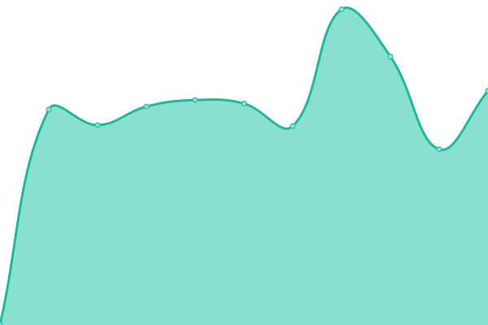
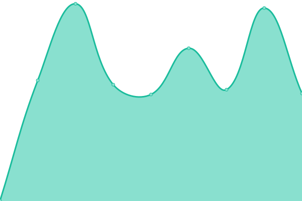
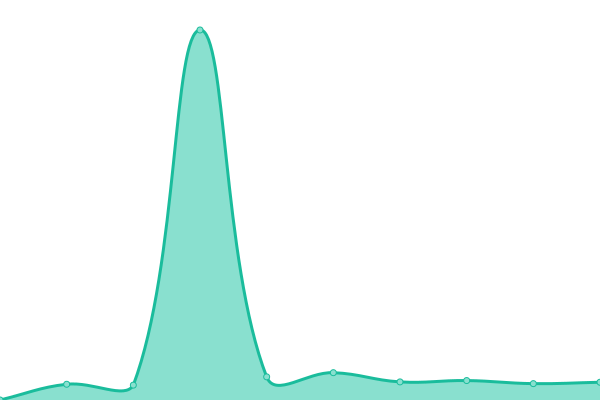

# [📈 Live Status](https://status.ttm.org): <!--live status--> **🟧 Partial outage**

This repository contains the open-source uptime monitor and status page for [tickets](https://ttm.org), powered by [Upptime](https://github.com/upptime/upptime).

With [Upptime](https://upptime.js.org), you can get your own unlimited and free uptime monitor and status page, powered entirely by a GitHub repository. We use [Issues](https://github.com/tickets/upptime/issues) as incident reports, [Actions](https://github.com/tickets/upptime/actions) as uptime monitors, and [Pages](https://status.ttm.org) for the status page.

<!--start: status pages-->
<!-- This summary is generated by Upptime (https://github.com/upptime/upptime) -->
<!-- Do not edit this manually, your changes will be overwritten -->
<!-- prettier-ignore -->
| URL | Status | History | Response Time | Uptime |
| --- | ------ | ------- | ------------- | ------ |
|  [TTM](https://ttm.org) | 🟩 Up | [ttm.yml](https://github.com/tickets/upptime/commits/HEAD/history/ttm.yml) | 

 754ms
     
 | 

<a href="https://status.ttm.org/history/ttm">98.57%</a>
    

|  [TICKETS.AF](https://tickets.af) | 🟩 Up | [tickets-af.yml](https://github.com/tickets/upptime/commits/HEAD/history/tickets-af.yml) | 

 1007ms
     
 | 

<a href="https://status.ttm.org/history/tickets-af">93.15%</a>
    

|  [TICKETS.AR](https://tickets.ar) | 🟩 Up | [tickets-ar.yml](https://github.com/tickets/upptime/commits/HEAD/history/tickets-ar.yml) | 

 2635ms
     
 | 

<a href="https://status.ttm.org/history/tickets-ar">93.60%</a>
    

|  [TICKETS.AX](https://tickets.ax) | 🟩 Up | [tickets-ax.yml](https://github.com/tickets/upptime/commits/HEAD/history/tickets-ax.yml) | 

 870ms
     
 | 

<a href="https://status.ttm.org/history/tickets-ax">93.65%</a>
    

|  [TICKETS.DZ](https://tickets.dz) | 🟩 Up | [tickets-dz.yml](https://github.com/tickets/upptime/commits/HEAD/history/tickets-dz.yml) | 

 1118ms
     
 | 

<a href="https://status.ttm.org/history/tickets-dz">94.08%</a>
    

|  [TICKETS.ASIA](https://tickets.asia) | 🟩 Up | [tickets-asia.yml](https://github.com/tickets/upptime/commits/HEAD/history/tickets-asia.yml) | 

 1853ms
     
 | 

<a href="https://status.ttm.org/history/tickets-asia">94.72%</a>
    

|  [TICKETS.BJ](https://tickets.bj) | 🟩 Up | [tickets-bj.yml](https://github.com/tickets/upptime/commits/HEAD/history/tickets-bj.yml) | 

 961ms
     
 | 

<a href="https://status.ttm.org/history/tickets-bj">94.93%</a>
    

|  [TICKETS.BO](https://tickets.bo) | 🟩 Up | [tickets-bo.yml](https://github.com/tickets/upptime/commits/HEAD/history/tickets-bo.yml) | 

 846ms
     
 | 

<a href="https://status.ttm.org/history/tickets-bo">92.73%</a>
    

|  [TICKETS.BA](https://tickets.ba) | 🟩 Up | [tickets-ba.yml](https://github.com/tickets/upptime/commits/HEAD/history/tickets-ba.yml) | 

 874ms
     
 | 

<a href="https://status.ttm.org/history/tickets-ba">92.95%</a>
    

|  [TICKETS.TUR.BR](https://tickets.tur.br) | 🟩 Up | [tickets-tur-br.yml](https://github.com/tickets/upptime/commits/HEAD/history/tickets-tur-br.yml) | 

 887ms
     
 | 

<a href="https://status.ttm.org/history/tickets-tur-br">91.20%</a>
    

|  [TICKETS.COM.KH](https://tickets.com.kh) | 🟩 Up | [tickets-com-kh.yml](https://github.com/tickets/upptime/commits/HEAD/history/tickets-com-kh.yml) | 

 1007ms
     
 | 

<a href="https://status.ttm.org/history/tickets-com-kh">90.67%</a>
    

|  [TICKETS.TD](https://tickets.td) | 🟩 Up | [tickets-td.yml](https://github.com/tickets/upptime/commits/HEAD/history/tickets-td.yml) | 

 1065ms
     
 | 

<a href="https://status.ttm.org/history/tickets-td">90.64%</a>
    

|  [TICKETS.CL](https://tickets.cl) | 🟩 Up | [tickets-cl.yml](https://github.com/tickets/upptime/commits/HEAD/history/tickets-cl.yml) | 

 883ms
     
 | 

<a href="https://status.ttm.org/history/tickets-cl">90.66%</a>
    

|  [TICKETS.中国](https://tickets.中国) | 🟩 Up | [tickets.yml](https://github.com/tickets/upptime/commits/HEAD/history/tickets.yml) | 

 1417ms
     
 | 

<a href="https://status.ttm.org/history/tickets">90.67%</a>
    

|  [TICKETS.COM.CO](https://tickets.com.co) | 🟩 Up | [tickets-com-co.yml](https://github.com/tickets/upptime/commits/HEAD/history/tickets-com-co.yml) | 

 797ms
     
 | 

<a href="https://status.ttm.org/history/tickets-com-co">90.67%</a>
    

|  [TICKETS.CR](https://tickets.cr) | 🟩 Up | [tickets-cr.yml](https://github.com/tickets/upptime/commits/HEAD/history/tickets-cr.yml) | 

 883ms
     
 | 

<a href="https://status.ttm.org/history/tickets-cr">93.92%</a>
    

|  [TICKETS.HR](https://tickets.hr) | 🟩 Up | [tickets-hr.yml](https://github.com/tickets/upptime/commits/HEAD/history/tickets-hr.yml) | 

 875ms
     
 | 

<a href="https://status.ttm.org/history/tickets-hr">97.55%</a>
    

|  [TICKETS.CY](https://tickets.cy) | 🟩 Up | [tickets-cy.yml](https://github.com/tickets/upptime/commits/HEAD/history/tickets-cy.yml) | 

 824ms
     
 | 

<a href="https://status.ttm.org/history/tickets-cy">97.35%</a>
    

|  [TICKETS.DO](https://tickets.do) | 🟩 Up | [tickets-do.yml](https://github.com/tickets/upptime/commits/HEAD/history/tickets-do.yml) | 

 1193ms
     
 | 

<a href="https://status.ttm.org/history/tickets-do">92.59%</a>
    

|  [TICKETS.TL](https://tickets.tl) | 🟩 Up | [tickets-tl.yml](https://github.com/tickets/upptime/commits/HEAD/history/tickets-tl.yml) | 

 1455ms
     
 | 

<a href="https://status.ttm.org/history/tickets-tl">92.46%</a>
    

|  [TICKETS.EC](https://tickets.ec) | 🟩 Up | [tickets-ec.yml](https://github.com/tickets/upptime/commits/HEAD/history/tickets-ec.yml) | 

 913ms
     
 | 

<a href="https://status.ttm.org/history/tickets-ec">89.84%</a>
    

|  [TICKETS.EG](https://tickets.eg) | 🟩 Up | [tickets-eg.yml](https://github.com/tickets/upptime/commits/HEAD/history/tickets-eg.yml) | 

 942ms
     
 | 

<a href="https://status.ttm.org/history/tickets-eg">92.70%</a>
    

|  [TICKETS.SV](https://tickets.sv) | 🟩 Up | [tickets-sv.yml](https://github.com/tickets/upptime/commits/HEAD/history/tickets-sv.yml) | 

 858ms
     
 | 

<a href="https://status.ttm.org/history/tickets-sv">93.60%</a>
    

|  [TICKETS.ET](https://tickets.et) | 🟩 Up | [tickets-et.yml](https://github.com/tickets/upptime/commits/HEAD/history/tickets-et.yml) | 

 1220ms
     
 | 

<a href="https://status.ttm.org/history/tickets-et">93.63%</a>
    

|  [TICKETS.GA](https://tickets.ga) | 🟩 Up | [tickets-ga.yml](https://github.com/tickets/upptime/commits/HEAD/history/tickets-ga.yml) | 

 873ms
     
 | 

<a href="https://status.ttm.org/history/tickets-ga">93.78%</a>
    

|  [TICKETS.GF](https://tickets.gf) | 🟩 Up | [tickets-gf.yml](https://github.com/tickets/upptime/commits/HEAD/history/tickets-gf.yml) | 

 921ms
     
 | 

<a href="https://status.ttm.org/history/tickets-gf">93.79%</a>
    

|  [TICKETS.COM.GE](https://tickets.com.ge) | 🟥 Down | [tickets-com-ge.yml](https://github.com/tickets/upptime/commits/HEAD/history/tickets-com-ge.yml) | 

 934ms
     
 | 

<a href="https://status.ttm.org/history/tickets-com-ge">87.99%</a>
    

|  [TICKETS.CO.DE](https://tickets.co.de) | 🟩 Up | [tickets-co-de.yml](https://github.com/tickets/upptime/commits/HEAD/history/tickets-co-de.yml) | 

 1611ms
     
 | 

<a href="https://status.ttm.org/history/tickets-co-de">90.23%</a>
    

|  [TICKETS.COM.GR](https://tickets.com.gr) | 🟩 Up | [tickets-com-gr.yml](https://github.com/tickets/upptime/commits/HEAD/history/tickets-com-gr.yml) | 

 903ms
     
 | 

<a href="https://status.ttm.org/history/tickets-com-gr">90.06%</a>
    

|  [TICKETS.GL](https://tickets.gl) | 🟩 Up | [tickets-gl.yml](https://github.com/tickets/upptime/commits/HEAD/history/tickets-gl.yml) | 

 933ms
     
 | 

<a href="https://status.ttm.org/history/tickets-gl">90.07%</a>
    

|  [TICKETS.GT](https://tickets.gt) | 🟥 Down | [tickets-gt.yml](https://github.com/tickets/upptime/commits/HEAD/history/tickets-gt.yml) | 

 4841ms
     
 | 

<a href="https://status.ttm.org/history/tickets-gt">88.04%</a>
    

|  [TICKETS.GY](https://tickets.gy) | 🟩 Up | [tickets-gy.yml](https://github.com/tickets/upptime/commits/HEAD/history/tickets-gy.yml) | 

 963ms
     
 | 

<a href="https://status.ttm.org/history/tickets-gy">92.66%</a>
    

|  [TICKETS.HT](https://tickets.ht) | 🟥 Down | [tickets-ht.yml](https://github.com/tickets/upptime/commits/HEAD/history/tickets-ht.yml) | 

 982ms
     
 | 

<a href="https://status.ttm.org/history/tickets-ht">96.75%</a>
    

|  [TICKETS.HN](https://tickets.hn) | 🟥 Down | [tickets-hn.yml](https://github.com/tickets/upptime/commits/HEAD/history/tickets-hn.yml) | 

 1042ms
     
 | 

<a href="https://status.ttm.org/history/tickets-hn">96.53%</a>
    

|  [TICKETS.ORG.IN](https://tickets.org.in) | 🟥 Down | [tickets-org-in.yml](https://github.com/tickets/upptime/commits/HEAD/history/tickets-org-in.yml) | 

 772ms
     
 | 

<a href="https://status.ttm.org/history/tickets-org-in">95.77%</a>
    

|  [TICKETS.CO.ID](https://tickets.co.id) | 🟥 Down | [tickets-co-id.yml](https://github.com/tickets/upptime/commits/HEAD/history/tickets-co-id.yml) | 

 1111ms
     
 | 

<a href="https://status.ttm.org/history/tickets-co-id">94.37%</a>
    

|  [TICKETS.CI](https://tickets.ci) | 🟥 Down | [tickets-ci.yml](https://github.com/tickets/upptime/commits/HEAD/history/tickets-ci.yml) | 

 1282ms
     
 | 

<a href="https://status.ttm.org/history/tickets-ci">93.94%</a>
    

|  [TICKETS.CO.JP](http://tickets.co.jp) | 🟥 Down | [tickets-co-jp.yml](https://github.com/tickets/upptime/commits/HEAD/history/tickets-co-jp.yml) | 

 3259ms
     
 | 

<a href="https://status.ttm.org/history/tickets-co-jp">94.38%</a>
    

|  [TICKETS.KE](https://tickets.ke) | 🟥 Down | [tickets-ke.yml](https://github.com/tickets/upptime/commits/HEAD/history/tickets-ke.yml) | 

 3228ms
     
 | 

<a href="https://status.ttm.org/history/tickets-ke">91.76%</a>
    

|  [TICKETS.LA](https://tickets.la) | 🟥 Down | [tickets-la.yml](https://github.com/tickets/upptime/commits/HEAD/history/tickets-la.yml) | 

 731ms
     
 | 

<a href="https://status.ttm.org/history/tickets-la">91.80%</a>
    

|  [TICKETS.LY](https://tickets.ly) | 🟥 Down | [tickets-ly.yml](https://github.com/tickets/upptime/commits/HEAD/history/tickets-ly.yml) | 

 978ms
     
 | 

<a href="https://status.ttm.org/history/tickets-ly">93.98%</a>
    

|  [TICKETS.MG](https://tickets.mg) | 🟥 Down | [tickets-mg.yml](https://github.com/tickets/upptime/commits/HEAD/history/tickets-mg.yml) | 

 897ms
     
 | 

<a href="https://status.ttm.org/history/tickets-mg">94.12%</a>
    

|  [TICKETS.MR](https://tickets.mr) | 🟥 Down | [tickets-mr.yml](https://github.com/tickets/upptime/commits/HEAD/history/tickets-mr.yml) | 

 1382ms
     
 | 

<a href="https://status.ttm.org/history/tickets-mr">94.17%</a>
    

|  [TICKETS.CO.MA](https://tickets.co.ma) | 🟥 Down | [tickets-co-ma.yml](https://github.com/tickets/upptime/commits/HEAD/history/tickets-co-ma.yml) | 

 806ms
     
 | 

<a href="https://status.ttm.org/history/tickets-co-ma">93.12%</a>
    

|  [TICKETS.CO.MZ](https://tickets.co.mz) | 🟥 Down | [tickets-co-mz.yml](https://github.com/tickets/upptime/commits/HEAD/history/tickets-co-mz.yml) | 

 797ms
     
 | 

<a href="https://status.ttm.org/history/tickets-co-mz">92.34%</a>
    

|  [TICKETS.NU](https://tickets.nu) | 🟥 Down | [tickets-nu.yml](https://github.com/tickets/upptime/commits/HEAD/history/tickets-nu.yml) | 

 959ms
     
 | 

<a href="https://status.ttm.org/history/tickets-nu">92.53%</a>
    

|  [TICKETS.COM.NI](https://tickets.com.ni) | 🟥 Down | [tickets-com-ni.yml](https://github.com/tickets/upptime/commits/HEAD/history/tickets-com-ni.yml) | 

 1198ms
     
 | 

<a href="https://status.ttm.org/history/tickets-com-ni">94.71%</a>
    

|  [TICKETS.NG](https://tickets.ng) | 🟥 Down | [tickets-ng.yml](https://github.com/tickets/upptime/commits/HEAD/history/tickets-ng.yml) | 

 1223ms
     
 | 

<a href="https://status.ttm.org/history/tickets-ng">91.05%</a>
    

|  [TICKETS.COM.PK](https://tickets.com.pk) | 🟥 Down | [tickets-com-pk.yml](https://github.com/tickets/upptime/commits/HEAD/history/tickets-com-pk.yml) | 

 830ms
     
 | 

<a href="https://status.ttm.org/history/tickets-com-pk">94.09%</a>
    

|  [TICKETS.PA](https://tickets.pa) | 🟥 Down | [tickets-pa.yml](https://github.com/tickets/upptime/commits/HEAD/history/tickets-pa.yml) | 

 949ms
     
 | 

<a href="https://status.ttm.org/history/tickets-pa">89.13%</a>
    

|  [TICKETS.COM.PY](https://tickets.com.py) | 🟥 Down | [tickets-com-py.yml](https://github.com/tickets/upptime/commits/HEAD/history/tickets-com-py.yml) | 

 954ms
     
 | 

<a href="https://status.ttm.org/history/tickets-com-py">88.21%</a>
    

|  [TICKETS.PE](https://tickets.pe) | 🟥 Down | [tickets-pe.yml](https://github.com/tickets/upptime/commits/HEAD/history/tickets-pe.yml) | 

 831ms
     
 | 

<a href="https://status.ttm.org/history/tickets-pe">89.12%</a>
    

|  [TICKETS.PH](https://tickets.ph) | 🟥 Down | [tickets-ph.yml](https://github.com/tickets/upptime/commits/HEAD/history/tickets-ph.yml) | 

 1464ms
     
 | 

<a href="https://status.ttm.org/history/tickets-ph">89.44%</a>
    

|  [TICKETS.PT](https://tickets.pt) | 🟥 Down | [tickets-pt.yml](https://github.com/tickets/upptime/commits/HEAD/history/tickets-pt.yml) | 

 972ms
     
 | 

<a href="https://status.ttm.org/history/tickets-pt">94.78%</a>
    

|  [TICKETS.COM.PR](https://tickets.com.pr) | 🟥 Down | [tickets-com-pr.yml](https://github.com/tickets/upptime/commits/HEAD/history/tickets-com-pr.yml) | 

 762ms
     
 | 

<a href="https://status.ttm.org/history/tickets-com-pr">94.45%</a>
    

|  [TICKETS.LC](https://tickets.lc) | 🟥 Down | [tickets-lc.yml](https://github.com/tickets/upptime/commits/HEAD/history/tickets-lc.yml) | 

 1592ms
     
 | 

<a href="https://status.ttm.org/history/tickets-lc">95.94%</a>
    

|  [TICKETS.SN](https://tickets.sn) | 🟥 Down | [tickets-sn.yml](https://github.com/tickets/upptime/commits/HEAD/history/tickets-sn.yml) | 

 2866ms
     
 | 

<a href="https://status.ttm.org/history/tickets-sn">92.28%</a>
    

|  [TICKETS.COM.SG](https://tickets.com.sg) | 🟥 Down | [tickets-com-sg.yml](https://github.com/tickets/upptime/commits/HEAD/history/tickets-com-sg.yml) | 

 744ms
     
 | 

<a href="https://status.ttm.org/history/tickets-com-sg">93.69%</a>
    

|  [TICKETS.SO](https://tickets.so) | 🟥 Down | [tickets-so.yml](https://github.com/tickets/upptime/commits/HEAD/history/tickets-so.yml) | 

 923ms
     
 | 

<a href="https://status.ttm.org/history/tickets-so">93.99%</a>
    

|  [TICKETS.SD](https://tickets.sd) | 🟥 Down | [tickets-sd.yml](https://github.com/tickets/upptime/commits/HEAD/history/tickets-sd.yml) | 

 1372ms
     
 | 

<a href="https://status.ttm.org/history/tickets-sd">98.24%</a>
    

|  [TICKETS.SR](https://tickets.sr) | 🟩 Up | [tickets-sr.yml](https://github.com/tickets/upptime/commits/HEAD/history/tickets-sr.yml) | 

 3500ms
     
 | 

<a href="https://status.ttm.org/history/tickets-sr">98.61%</a>
    

|  [TICKETS.SE](https://tickets.se) | 🟥 Down | [tickets-se.yml](https://github.com/tickets/upptime/commits/HEAD/history/tickets-se.yml) | 

 927ms
     
 | 

<a href="https://status.ttm.org/history/tickets-se">89.32%</a>
    

|  [TICKETS.TJ](https://tickets.tj) | 🟥 Down | [tickets-tj.yml](https://github.com/tickets/upptime/commits/HEAD/history/tickets-tj.yml) | 

 1316ms
     
 | 

<a href="https://status.ttm.org/history/tickets-tj">94.70%</a>
    

|  [TICKETS.TZ](https://tickets.tz) | 🟥 Down | [tickets-tz.yml](https://github.com/tickets/upptime/commits/HEAD/history/tickets-tz.yml) | 

 897ms
     
 | 

<a href="https://status.ttm.org/history/tickets-tz">94.75%</a>
    

|  [TICKETS.IN.TH](https://tickets.in.th) | 🟥 Down | [tickets-in-th.yml](https://github.com/tickets/upptime/commits/HEAD/history/tickets-in-th.yml) | 

 1074ms
     
 | 

<a href="https://status.ttm.org/history/tickets-in-th">94.23%</a>
    

|  [TICKETS.TG](https://tickets.tg) | 🟥 Down | [tickets-tg.yml](https://github.com/tickets/upptime/commits/HEAD/history/tickets-tg.yml) | 

 1036ms
     
 | 

<a href="https://status.ttm.org/history/tickets-tg">93.93%</a>
    

|  [TICKETS.CO.TT](https://tickets.co.tt) | 🟥 Down | [tickets-co-tt.yml](https://github.com/tickets/upptime/commits/HEAD/history/tickets-co-tt.yml) | 

 874ms
     
 | 

<a href="https://status.ttm.org/history/tickets-co-tt">93.95%</a>
    

|  [TICKETS.TN](https://tickets.tn) | 🟥 Down | [tickets-tn.yml](https://github.com/tickets/upptime/commits/HEAD/history/tickets-tn.yml) | 

 2961ms
     
 | 

<a href="https://status.ttm.org/history/tickets-tn">94.56%</a>
    

|  [TICKETS.WEB.TR](https://tickets.web.tr) | 🟥 Down | [tickets-web-tr.yml](https://github.com/tickets/upptime/commits/HEAD/history/tickets-web-tr.yml) | 

 881ms
     
 | 

<a href="https://status.ttm.org/history/tickets-web-tr">94.59%</a>
    

|  [TICKETS.IN.UA](https://tickets.in.ua) | 🟥 Down | [tickets-in-ua.yml](https://github.com/tickets/upptime/commits/HEAD/history/tickets-in-ua.yml) | 

 1042ms
     
 | 

<a href="https://status.ttm.org/history/tickets-in-ua">94.62%</a>
    

|  [TICKETS.ME.UK](https://tickets.me.uk) | 🟥 Down | [tickets-me-uk.yml](https://github.com/tickets/upptime/commits/HEAD/history/tickets-me-uk.yml) | 

 823ms
     
 | 

<a href="https://status.ttm.org/history/tickets-me-uk">95.26%</a>
    

|  [TICKETS.US](https://tickets.us) | 🟥 Down | [tickets-us.yml](https://github.com/tickets/upptime/commits/HEAD/history/tickets-us.yml) | 

 763ms
     
 | 

<a href="https://status.ttm.org/history/tickets-us">95.31%</a>
    

|  [TICKETS.COM.VE](https://tickets.com.ve) | 🟥 Down | [tickets-com-ve.yml](https://github.com/tickets/upptime/commits/HEAD/history/tickets-com-ve.yml) | 

 865ms
     
 | 

<a href="https://status.ttm.org/history/tickets-com-ve">95.35%</a>
    

|  [TICKETS.VN](https://tickets.vn) | 🟥 Down | [tickets-vn.yml](https://github.com/tickets/upptime/commits/HEAD/history/tickets-vn.yml) | 

 952ms
     
 | 

<a href="https://status.ttm.org/history/tickets-vn">89.97%</a>
    

<!--end: status pages-->

[**Visit our status website →**](https://status.ttm.org)

## 📄 License

- Powered by: [Upptime](https://github.com/upptime/upptime)
- Code: [MIT](./LICENSE) © [tickets](https://ttm.org)
- Data in the `./history` directory: [Open Database License](https://opendatacommons.org/licenses/odbl/1-0/)
